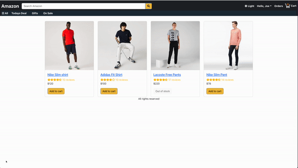

# TypeScript MERN Amazon Clone

This is a full-featured, robust, and production-ready web application developed using MongoDB, Express.js, React.js, Node.js (commonly known as the MERN stack) enhanced with TypeScript for strong typing and bundled with Vite for ultra-fast bundling and hot module replacement.

### Here is the [link](ts-mern-amazon-clone.onrender.com/)

## Key Features:

1. User Authentication: Sign up, Sign in, Sign out functionality.
2. Role-Based Access: Different access levels for regular users and admins.
3. Product Listing: Displays a list of products with pagination.
4. Product Search: Users can search for products using a search bar.
5. Shopping Cart: Users can add products to the cart and checkout.
6. Order History: Users can view their past orders.
7. Admin Dashboard: Admin users can add, edit, or delete products.
8. API Integration: Uses a custom-built API for server communication.

## Get start

```
npm run build
npm start
```

### Demo:


